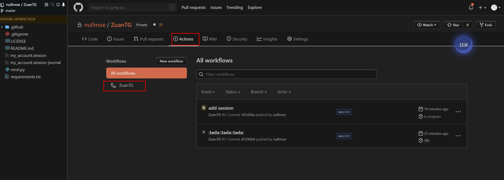

# ZuanTG

`telegram` 祖安助手

## 功能描述

用户自己发送任意文本触发`祖安脚本`回复祖安语录，任意用户回复自己会触发`祖安脚本`回复该用户祖安语录。

## 效果图


## 使用

* 由于之后之后的`session`文件不能公开，为了保护你账户的安全，请直接`clone`到本地。

```shell
python3 -m pip install requirements.txt
```

* 修改`nmsl.py`的`account_id`，对应`telegram`用户的`id`，然后执行`python3 nmsl.py`
* 本地通过手机号验证后会生成`session`文件，然后再将本地项目`push`到`github`**私有仓库**即可。

* 注：没有`session`文件push到`github`之后`actions`会出错。

## 设置 `GitHub Actions`

* 申请`telegram` 的 `api_id`和 `api_hash`: https://my.telegram.org


* 在项目设置添加`secrets` 添加 `API_HASH`, `API_ID`


* 执行脚本



